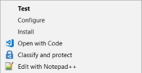

# Creating screen savers for Windows using Processing

This is an experiment for a workshop in which a Processing sketch is exported and turned into a screen saver for Windows. A version for Mac OS is not yet available.

## Disclaimer

The code and techniques described here are not meant as a guideline or "best-practices". It has not been tested thoroughly, and it is meant as didactic and exploratory purposes only.

## TL;DR

1. Download [JNA library](https://github.com/java-native-access/jna/releases). I used version `jna-4.5.2.jar`  
2. In Processing, create a new sketch, or save a copy of an existing one.
3. Copy the JNA jar file to a sub-folder `code` inside your sketch. The `code` folder lies in the same level as your `.pde` file(s) and next to e.g. `data` folder
4. Add a new tab and copy and paste the contents of the file `mainCustomWindows.pde`.
5. In the new tab, replace `sketch_screensaver_demo` with the exact name of your sketch
6. From processing Export the application as `.exe`
7. Make a screen saver by renaming the `.exe` to `.scr`

## Introduction to exporting Processing sketches and Windows screen savers

You can skip this section if...

* you know how to export Processing into executable files
* you know how make Windows screen savers from a executable file

### Exporting a sketch from Processing

From Processing, you can export a sketch, which creates an executable file. This is available under `File -> Export Application`.  


After hitting `Export`, you will see two new folders in your sketch location:

* application.windows64
* application.windows32

Inside each folder, you find a `.exe` file, which is your sketch as a Windows application, which you can run without Processing. If you're interested in more details, check [Exporting - Info and Tips](https://github.com/processing/processing/wiki/Export-Info-and-Tips).

### Windows screen savers

You can turn a Windows executable file by renaming from `.exe` to `.scr`. After doing that, you get new options on the context menu (mouse right-click):



`Install` opens Windows screen saver settings dialog:  


The changes we will make in Processing is to allow the `Settings...` and `Preview` options to work properly.  

## Modifications in Processing for Windows screen savers

In order to make the screen saver handle `Settings...` and `Preview`, we need to add a piece of code, which will make our application handle the parameters which Windows sends to all screen savers.

In order to do that, start by adding a new tab. I called it `customMainWindows` (tab name is irrelevant):

``` Java  
static public void main(String[] args) {
}
````

In this function will add the relevant code for handling preview, settings and presentation mode of the screen saver. Windows will
"tell" your sketch that is running in preview or presentation mode by passing the values `/s`, `/c` or `/p` as arguments, in the `args[]` array.  

If you are running the sketch from the Processing environment, or by double clicking the `.exe` file, then no arguments are passed:

``` Java
 if (args == null || args.length == 0)
  {
    //no additional arguments passed to the Processing application.
    //this happens e.g. if you double-click the .exe file in Windows explorer
    //or run it from command line without any arguments.
    PApplet.main(appletArgs);
    return;
  }
```

## Handling configuration mode

When you press the `Settings...` button, Windows will run the application passing the `/p` argument. Here you could for example create a dialog to adjust the parameters of your sketch - up to you to implement.

``` Java
  String firstArgument = args[0].toLowerCase().trim();
  
  if (firstArgument.equals("/c")) // Screen saver is running in Configuration  
                                  // mode (you pressed "Settings..." in Windows  
                                  // screen saver settings dialog)
  {
    // Here you could add code to show a configuration window
    // to change the parameters of the sketch.
    // In this demo we show only a message box and return
    String infoMessage = "This screen-save does not have configurable settings.";
    javax.swing.JOptionPane.showMessageDialog(null, infoMessage, "Configuration", javax.swing.JOptionPane.INFORMATION_MESSAGE);
    return;
```

## Handling preview mode

The most complex part of the code is actually optional - the Preview mode is  used simply to show a miniature of the application in the Settings dialog.
This part of the code uses [Java Native Access (JNA)](https://github.com/java-native-access/jna), which allows Java code to call Windows API, and manipulate the dialogs and windows.

In this mode, Windows will pass also a second argument in `args[1]`, containing
a handle to parent box - the black rectangle inside the settings dialog where  
the miniature screen-saver is displayed. We should use this handle, an identifier to the window, to resize and reposition our Processing application.

``` Java

    if (firstArgument.equals("/p")) { //Screen saver is running in Preview
                                      // mode. In this case, windows  
                                      // passes also a second  
                                      // argument  
                                      // to the sketch
    PApplet.main(appletArgs);

    //Source: http://www.rgagnon.com/javadetails/java-detect-if-a-program-is-running-using-jna.html
    HWND hwndChild = User32.INSTANCE.FindWindow("_newt_clazz0", null); //windows class for the Processing sketch
    HWND hwndParent = new HWND((new User32.INT_PTR(Integer.parseInt(secondArgument))).toPointer());


    RECT ParentRect = new RECT();
    User32.INSTANCE.GetWindowRect(hwndParent, ParentRect);


    //https://msdn.microsoft.com/en-us/library/windows/desktop/ms633541(v=vs.85).aspx
    User32.INSTANCE.SetWindowLong(hwndChild, WinUser.GWL_STYLE, 0); //keeps all existing styles, minus WS_CAPTION
    User32.INSTANCE.SetWindowLong(hwndChild, WinUser.GWL_STYLE, WinUser.WS_CHILDWINDOW | WinUser.WS_VISIBLE ); //keeps all existing styles, minus WS_CAPTION

    //SetWindowsPos:https://msdn.microsoft.com/en-us/library/windows/desktop/ms633545(v=vs.85).aspx
    HWND zero = new HWND((new User32.INT_PTR(Integer.parseInt("0", 16))).toPointer()); //replaces constant HWND_TOP (0): Places the window at the top of the Z order.
    User32.INSTANCE.SetParent(hwndChild, hwndParent);
    User32.INSTANCE.SetWindowPos(hwndChild, zero, 0, 0, ParentRect.right-ParentRect.left, ParentRect.bottom-ParentRect.top, 0x0040);  
```